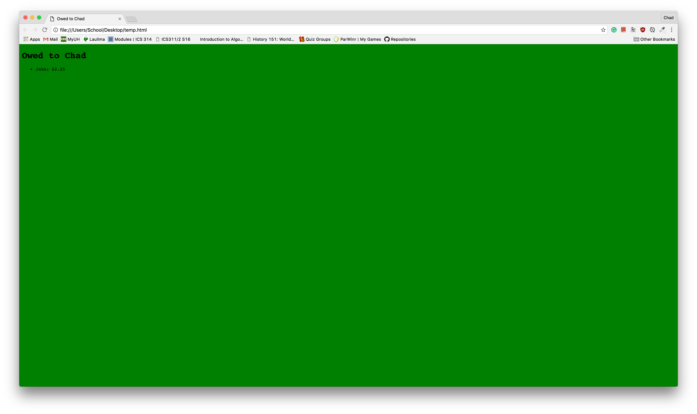
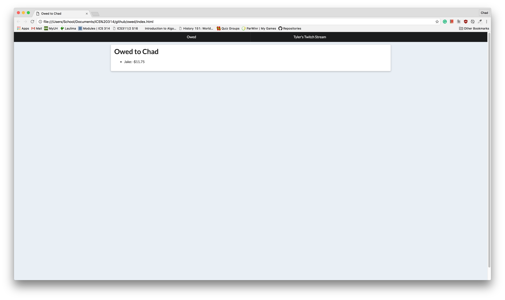

<h2>Introduction</h2>

Over the past two weeks, I went from learning the basics of HTML and CSS to learning how to use a UI framework called <a href="http://semantic-ui.com/" target="_blank">Semantic UI</a>. Learning the basics of HTML and CSS made me think that making an acceptable website was extremely difficult. After I started learning more about how to use Semantic UI, it became much easier to create acceptable websites.

<h2>The Learning Process</h2>

<h3>My First Website</h3>

Above is a picture of one of my first websites. I quickly set it up so I could keep track of how much my friends owed me. This is the first version from when I was only using HTML and CSS. Just looking at the site now makes my eyes hurt. I read an article by Erik Kennedy
titled <a href="https://medium.com/@erikdkennedy/7-rules-for-creating-gorgeous-ui-part-1-559d4e805cda#.tiandma7i" target="_blank">7 Rules for Creating Gorgeous UI</a>, which helped me a lot to create a better looking website. 

<h3>After Semantic UI</h3>

By just using a UI framework like Semantic UI, I was able to greatly improve the look and feel of my simple website. I also started to get a little more comfortable with using Semantic UI so I decided to add a menu bar and a page with my friend's Twitch stream.

<h3>Recreating citymill.com</h3>

To further develop my skills with Semantic UI, I created a remake of City Mill's <a href="http://www.citymill.com/" target="_blank">website</a>. I think that the end result was okay, but there were still some formatting issues. 

<h3>Bar 35</h3>

This was my most recent attempt at recreating a website. This time I attempted to recreate Bar 35's <a href="http://www.bar35hawaii.com/" target="_blank">website</a>. I found that with each website I recreated, I was able to learn more. It was a lot easier for me to learn how to use Semantic UI by actually using it instead of watching video tutorials.

<h3>From Good to Great</h3>

There was a steep learning curve to learn how to use Semantic UI. The most time consuming part about making a website with Semantic UI is learning what classes to use to get the desired results. I am confident that over time, I will be able to develop an intuition on what classes to use. Learning how to use a UI framework can be similar to learning a programming language. Learning what data structures or functions are available to you is what contributes most to the learning curve when learning a new programming language. Once I was able to become comfortable with using the classes in Semantic UI, I was able to build websites even faster. Now that my websites look good, the next step will be to make them look great and that can be an even larger challenge. 