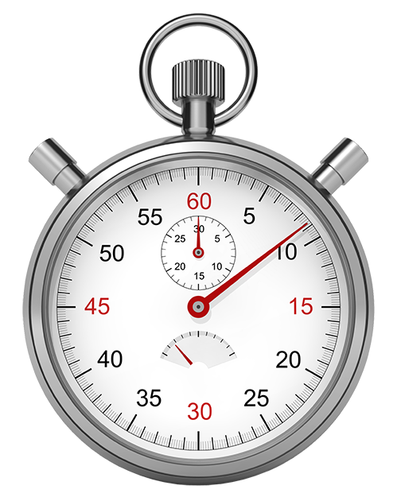

<H2> My First Introduction to JavaScript and First Thoughts</H2>
It has been a week since I was first introduced to JavaScript. JavaScript is the only programming language that I have learned other than Java. So far, my experience with learning JavaScript has been quite good. Because JavaScript is so similar to Java, I did not have much of a problem picking up the syntax. The simplicity of JavaScript makes things easier when I am writing small bits of code, but I can see myself possibly running into problems in the future with larger code. Because there are not a lot of strict rules like Java, it’s a lot easier to focus on the algorithm or idea behind a program instead of the code being cluttered with things that just need to be there. 

<H2>Where I Learned JavaScript</H2>

I learned JavaScript through the <a href="https://www.freecodecamp.com/" target="_blank"> freeCodeCamp </a> online course. This approach was different from when I learned Java, because I learned the basics of Java over the course of a semester in a college class. The freeCodeCamp course seemed like it was pretty straight forward and easy to understand, but here were times during the online course where I felt like talking things over with a fellow classmate. The freeCodeCamp course was definitely more individual focused. 

<H2>Athletic Software Engineering</H2>

In the software engineering class that I’m currently in, we are using an athletic software engineering approach. Athletic software engineering uses workouts of the day (WODs), which consists of a small problem that needs to be solved by creating a function within a certain amount of time. I have only completed four WODs so far with only one graded, but I am liking the idea of them. The WOD is a great opportunity for people learning software engineering to become quicker at solving problems. The WOD encourages me to spend more time analyzing and planning out my program before I actually begin typing. With each WOD that I complete, I feel like I am getting quicker. Because the WOD is a timed exercise, I find it to be a little stressful because I need to work against the clock, but I think that the stress is good, because a time is often the limitation to any kind of project. 
