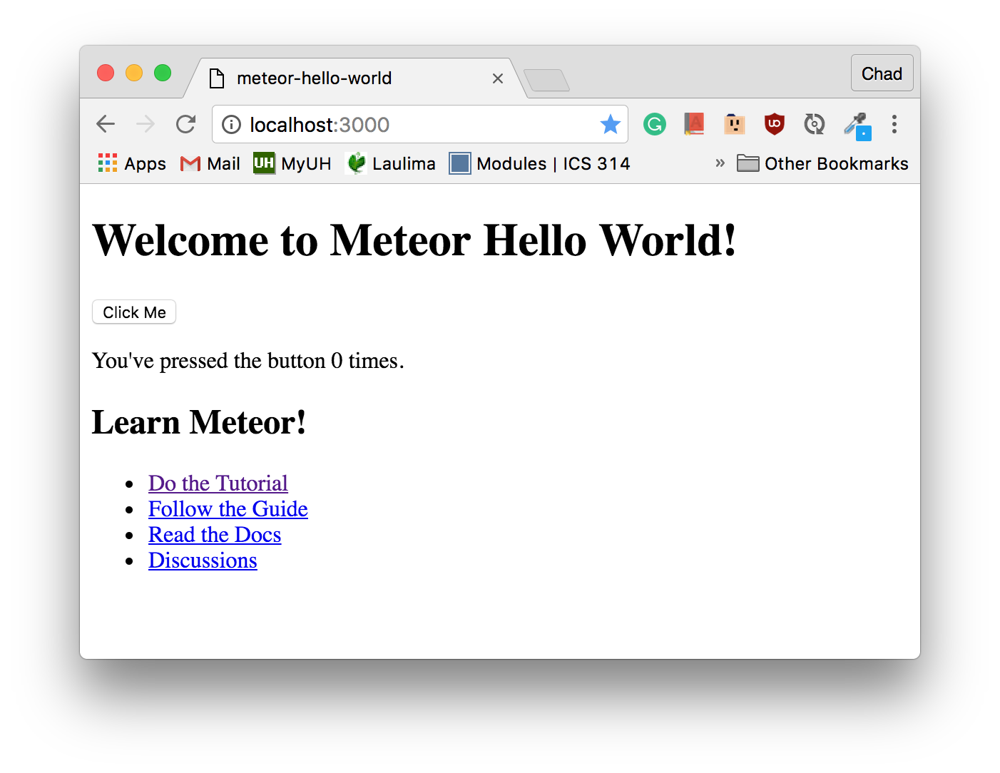
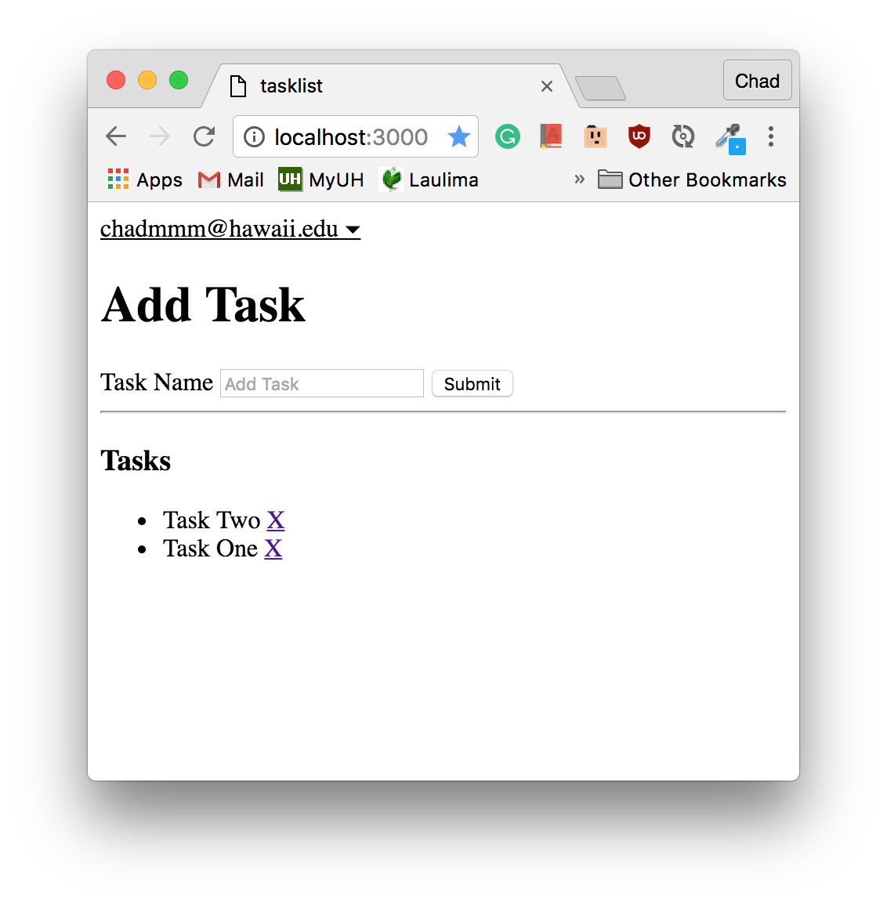
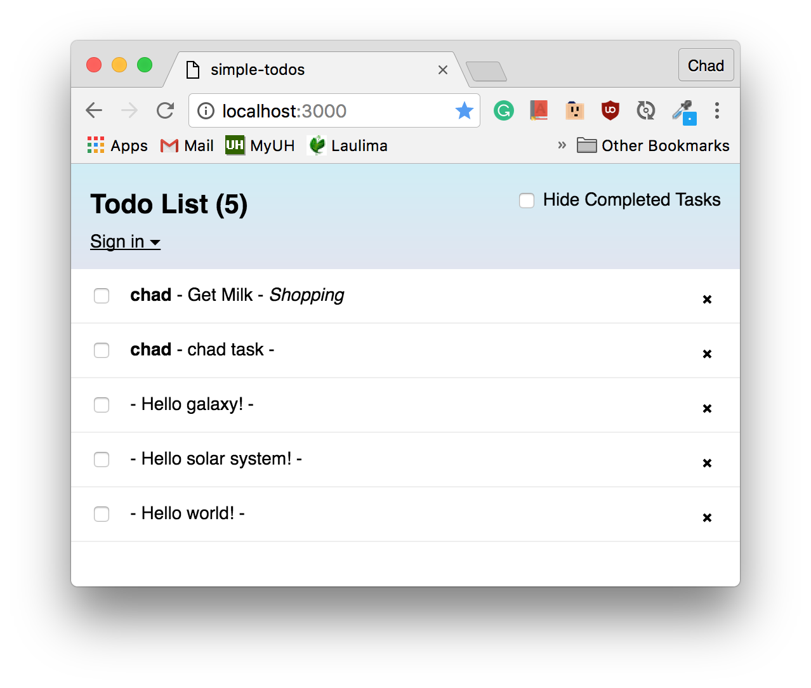
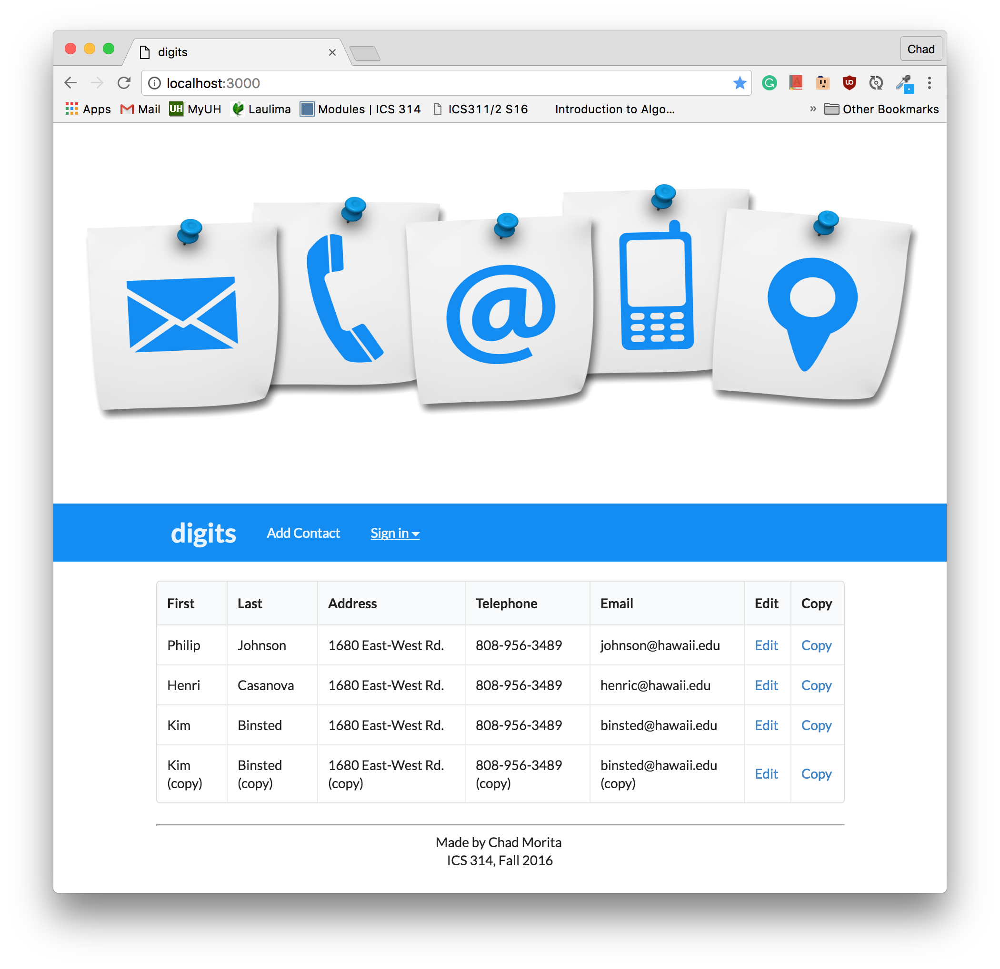

<h2>Learning how to Learn</h2>

Right now, I am in my second year of college. Over the short amount of time that I spent in college so far, I've learned a lot about what methods of learning work best for me. One important thing that I've learned is to have an open mind about different learning techniques. Over the past two weeks, I have been learning how to use the <a target="_blank" href="https://www.meteor.com/">Meteor Framework</a> to create web applications. When I was first introduced to Meteor, I was warned about the steep learning curve and I immediately was faced with the steep learning curve once I started working with Meteor.

<h2>Week 1 of Meteor</h2>

<h3>Hours of copying code</h3>

The first few activities designed to familiarize me with Meteor had me feeling like I was not accomplishing anything. Most of the work for the activities was just following a tutorial that told me where to put files and what to put into those files. There were explanations for why each step was important, but most of the information did not "stick" for me. The tutorials mentioned alternate file structures, helper methods, etc., but I had a difficult time reasoning about everything.

<h4>Meteor Hello World</h4>
The first tutorial that I did was a simple hello world application.

This tutorial walked me through the setup and everything did not seem so bad, but at this point, I did not understand much about the file structure.

<h4>Meteor in 50 Minutes</h4>

Meteor in 50 Minutes was the title of the next activity that I did. For this activity, I had to replicate the example Meteor application from the Meteor.js in 50 Minutes screencast. The title of this activity was deceiving, because although the screencast was 50 minutes long, it took me about two hours to completely replicate the application. For this activity, it felt like a lot of copying and at this point, things were still not making much sense to me. I was starting to become worried about if I was falling and not learning what I was supposed to be learning.

<h4>Meteor Blaze Tutorial</h4>

This is where things started to make more sense. The Meteor Blaze Tutorial was a tutorial on how to make a simple todo app. It took me a little over two hours to complete this tutorial, which is longer than the Meteor in 50 Minutes, but I feel like I learned a lot more from this tutorial. 

<h2>Starting to understand things</h2>

At this point I had already spent somewhere around four and a half hours learning Meteor. Only after four hours, things were starting to make sense to me. Because I was starting to understand everything, I thought about what I did in the previous tutorials and I realized that although the tutorials seemed useless at first, they were helpful in the end. The previous tutorials served no purpose to me earlier, but since I now understood a little bit about Meteor, I could review what I did for the old tutorials and understand what I did. 

<h2>Week 2 of Meteor</h2>

<h3>Digits</h3>

During week two learning Meteor, I worked on several small activities that would ultimately create a web page for contact information. Each activity added a new feature to the page like editing, copying, and deleting contacts. In this activity, I learned a lot more about the process of going from an idea for a feature to implementing the feature.

<h2>The learning is not over</h2>
Because I now had a better understanding of how Meteor works and the various structures, I felt that I had made it over the initial learning curve. Once I made it over the initial learning curve, I was able to see that there are still many more things to learn about Meteor.
