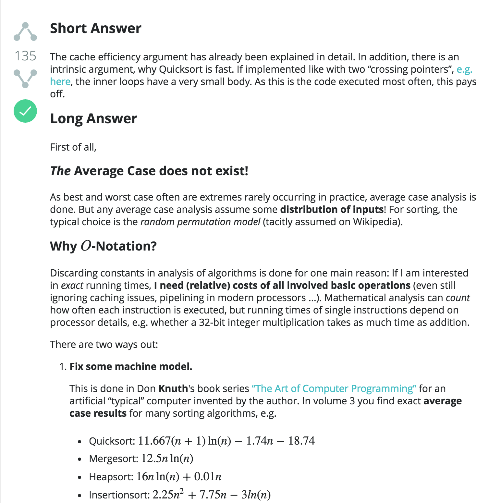

<H2>Wax on, wax off?</H2>

In the movie, The Karate Kid, Mr. Miyagi tells Daniel to "wax on, wax off". Daniel went to Mr. Miyagi to learn Karate so he is wondering why this old man is making him wax his car. Daniel later finds out that the movements of applying and removing wax transferred over to Karate moves. The lesson of this is that people often have a lot of enthusiasm about the end goal instead of having enthusiasm about the journey to the end goal. There is a lesson in almost everything.

<H2>How does "wax on, wax off" relate to software engineering?</H2>

There are some people that get into software engineering because they hear that they have the possibility of making a lot of money. This is the end goal. What these people do not realize is that it takes a lot of work to become successful. In order to be the best, you need to keep up with all of the latest programming languages and other technologies. Everything is changing so often in the field of software that in order to be successful, you need to be constantly learning new things.

<H2>Learning by questioning</H2>

Questions can be a valuable resource for learning. A well formulated question or a "smart" question can benefit both the questioner and any other person that views the discussion that was provoked by the question. One of the first steps to formulating a "smart" question is to do research to make sure that the question has not already been answered. Most questions don't even need to be asked, because there is a lot of information out there. If the answer to the question cannot be found, then the question could be well formulated so that it will encourage a good response. Simply asking a question that has little effort put into it will often times lead to a low effort answer. More information about forming a good question can be found in Eric Raymond's essay, <a href="http://www.catb.org/esr/faqs/smart-questions.html" target="_blank"> How To Ask Questions The Smart Way</a>.

<H2>An example of a "not smart" question</H2>

<H3>Question</H3>

The  <a href="http://cs.stackexchange.com/questions/52138/sort-complexity-in-a-random-array" target="_blank"> question</a> above is from a post made by the user Maxim on Stack Exchange. This is an example of a "not smart" question for many reasons. Starting with the subject line, Maxim chose a rather vague subject. The subject does not do much to give the forum user an idea of what the question is going to be about. The question scenario also seems like it could be an assigned homework problem. Maxim is asking which sorting algorithm will be the best, but does not state what kind of complexity (time, space). A comment mentions this vagueness on what "best" means.

At the end of the question, Maxim asks if there is a difference between float values and integers and also mentions linked lists. There were no hints given in the subject line or tags that would imply that the question was also about linked lists and float values. By mentioning linked lists, the question strays off from being about sorting in arrays.

<H3>Replies</H3>

The replies also reflect the effort put into this question. The first reply is by the user D.W., a moderator of the forum asking about what research has been done. The question does not give any information about previous research attempts made. D.W. also links to a <a href="http://cs.stackexchange.com/help/how-to-ask" target="_blank"> guide</a> on asking good questions.

Maxim then decides to reply to the other replies to clarify. What Maxim says changes the question all together from what it originally was. The subject line does not even seem relevant at this point.

<H2>An example of a "smart" question</H2>

<H3>Question</H3>

Starting off with the subject line of the <a href="http://cs.stackexchange.com/questions/3/why-is-quicksort-better-than-other-sorting-algorithms-in-practice" target="_blank"> question</a> posted by the user Janoma, there are already signs that more effort was put into forming this question. The subject line is more specific by naming what sort is being discussed. Janoma starts their question with stating what they know and then goes on to state what they found along with a link. The question is then stated along with an explanation. This question has much better formatting with boldfaced words, links, and paragraphs that all add to the chances of this question being thoroughly answered. Another nice touch is the updates so other users can quickly see what points were clarified.

In this case, the amount of effort put into forming this question, resulted in a thorough answer. Janoma probably read the answer and learned a lot from it, but what is even more important is that this discussion will remain on the site for anyone who may have a similar question in the future. This "smart" question has created a great resource as a byproduct.

<H2>Conclusion</H2>

As demonstrated above, a smart question can help more than just the person asking it. The process of forming a "smart" question may seem like a tedious task like applying wax to a car, but in the end, there is always a lesson to be learned.
