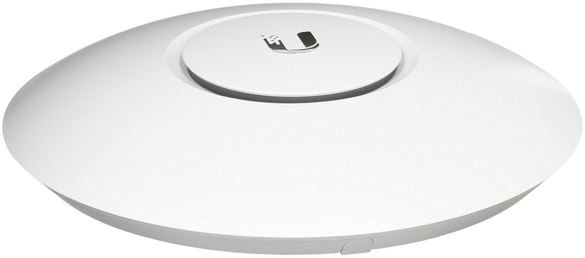

<H2>Summary</H2>
This project was one of my summer projects that I worked on and it is still a work in progress. Instead of doing everthing at the same time, I have been adding new elements over a long period of time. The reason for doing this project is to improve connectivity within my house and to also have a central area where I can back up my important data. For the networking side of things, I replaced my old Netgear wifi router with a separate router, switch, and wireless access point. I also replaced my rented cable modem with one that I purchased. My house has also been wired up with ethernet calbes that to go rooms with computers. As far as data storage goes, I configured a network attatched storage and a backup hard drive. 

<H2>Routing/Modem</H2>

<H3>Cable Modem</H3>
Previously, I rented a cable/router combo from my internet service provider, which was an Arris DG1670A pictured below.

I calculated that for the price that I had to pay to rent the modem, I could purchase my own modem and it would pay for itself in roughly a year. I decided to purchase an Arris SURFboard SB1683 cable modem.

<H3>Router</H3>
My old Netgear wifi router was starting to show signs of it's age so I replaced it with a Ubiquiti Edgerouter Lite. I chose this router because it offered many advanced features along with performance for a reasonable price. This router offers a command line interface that allows access to many more features than the graphical user interface. The software running on the router is based off of the Vyatta routing software, which is a special Debian-based Linux distribution. 

<H2>Switching</H2>

For switching, I chose a simple Negear GS108-400NAS unmanaged switch. The reason that I chose an unamanged switch versus a managed switch was because I did not really need a lot of fancy switching features like quality of service (QoS). I selected this specific switch because of it had eight ports, which would fit my needs and it also came with lifetime warranty.

<H2>Wireless</H2>

I chose the Ubiquiti UAP-AC-LITE as my wireless access point. Something that my old wireless router lacked was wireless AC, which this new access point had. I chose the lite version of this access point over the pro version because of the price, but now that I have had some time to evaluate my decision, I would have gone with the pro version. When using wireless 2.4 GHz technology, the throughput of the access point is slower than my wide area network (WAN) bandwidth. If I had gotten the pro version, I would have been able to get a higher wireless throughput. Although, I do not regret my choice that much, because most of my wifi devices use wireless AC. 

