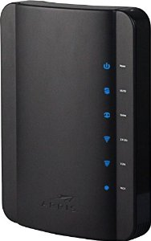
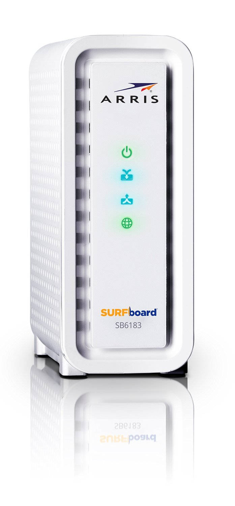
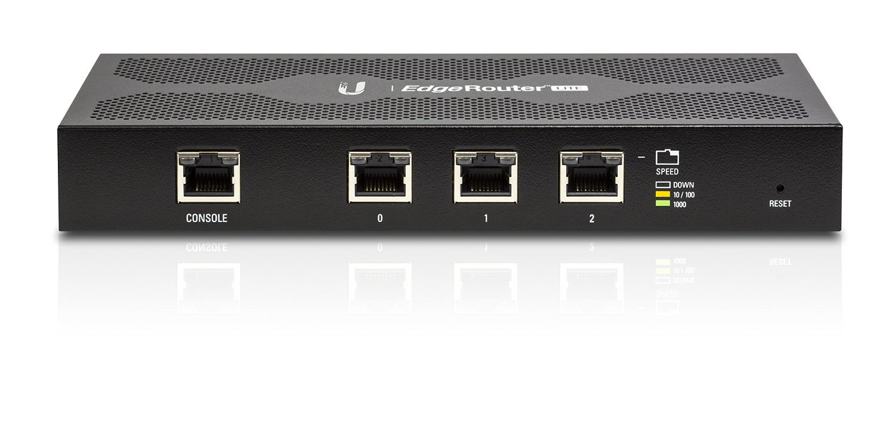
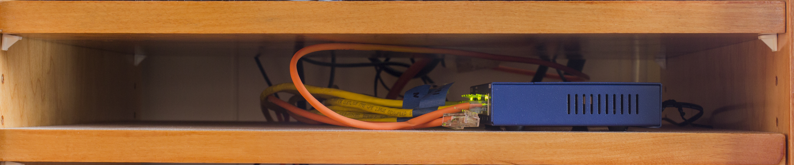
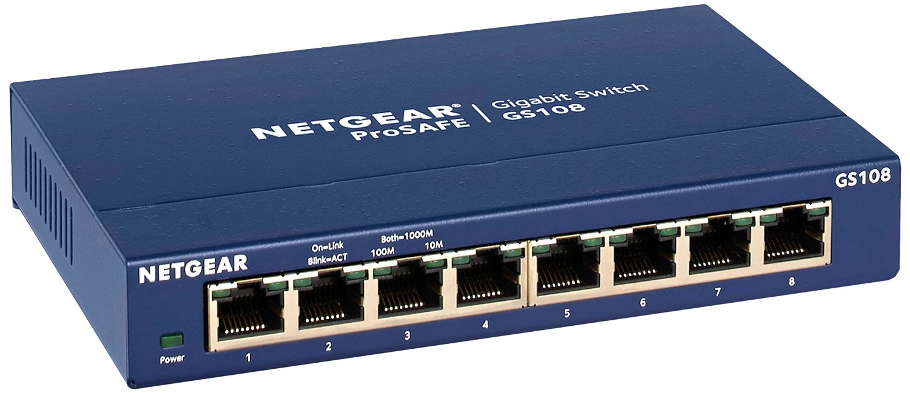

<H2>Summary</H2>
This project was one of my summer projects that I worked on and it is still a work in progress. Instead of doing everthing at the same time, I have been adding new elements over a long period of time. The reason for doing this project is to improve connectivity within my house and to also have a central area where I can back up my important data. For the networking side of things, I replaced my old Netgear wifi router with a separate router, switch, and wireless access point. I also replaced my rented cable modem with one that I purchased. My house has also been wired up with ethernet calbes that to go rooms with computers. As far as data storage goes, I configured a network attatched storage and a backup hard drive.

<H2>Routing/Modem</H2>

<H3>Cable Modem</H3>
Previously, I rented a cable/router combo from my internet service provider, which was an Arris DG1670A pictured below.

I calculated that for the price that I had to pay to rent the modem, I could purchase my own modem and it would pay for itself in roughly a year. I decided to purchase an Arris SURFboard SB1683 cable modem.

<H3>Router</H3>
My old Netgear wifi router was starting to show signs of it's age so I replaced it with a Ubiquiti Edgerouter Lite. I chose this router because it offered many advanced features along with performance for a reasonable price. This router offers a command line interface that allows access to many more features than the graphical user interface. The software running on the router is based off of the Vyatta routing software, which is a special Debian-based Linux distribution.

<H2>Switching</H2>

For switching, I chose a simple Negear GS108-400NAS unmanaged switch. The reason that I chose an unamanged switch versus a managed switch was because I did not really need a lot of fancy switching features like quality of service (QoS). I selected this specific switch because of it had eight ports, which would fit my needs and it also came with lifetime warranty.

<H2>Wireless</H2>

I chose the Ubiquiti UAP-AC-LITE as my wireless access point. Something that my old wireless router lacked was wireless AC, which this new access point had. I chose the lite version of this access point over the pro version because of the price, but now that I have had some time to evaluate my decision, I would have gone with the pro version. When using wireless 2.4 GHz technology, the throughput of the access point is slower than my wide area network (WAN) bandwidth. If I had gotten the pro version, I would have been able to get a higher wireless throughput. Although, I do not regret my choice that much, because most of my wifi devices use wireless AC.

<H2>Ethernet Wiring</H2>

For each room in my house with a device that requires an Internet connection, I ran two Cat6 ethernet cables. I ran the cable through 1-1/2 inch schedule 40 PVC conduit. In each room, I terminated the ethernet wires with wall jacks. At the other end of the wire, by the switch, I terminated the cables with RJ-45 connectors. Looking back at this, a patch panel would have been a better solution. The wall jack in some rooms also includes a coaxial connector for cable television. Previously, the cable ran into the house through a hole in the wall. The organization of wires in my network cabinet will be completed soon.

<H2>Data Storage</H2>

The data storage section of my network cabinet is made up of a Western Digital EX4100 network attatched storage (NAS) and a 6 terabyte (TB) desktop hard drive. The NAS is responsible for centralizing all of my important data. There are four 3TB Western Digital Red drives in the NAS setup in RAID (redundant array of independent disks) 10. You can find more information about RAID <a href="http://www.raid-calculator.com/raid-types-reference.aspx">here</a>. The NAS also functions as an FTP server so I can access some of my files while I am away from home.

The 6TB desktop hard drive serves as an offline backup of the data that is on my NAS. This offline backup of data is there so that should anything happen to my online copy of my data that is stored on my NAS, I will still have an incremental copy of my data. This offline backup is a part of the 3-2-1 rule of data storage. There is a video below on that topic. Currently, I do not have a complete offsite backup because I am still looking at options and locations to have my offsite backup.
<iframe width="560" height="315" src="https://www.youtube.com/embed/wLX5wEUGlE0" frameborder="0" allowfullscreen></iframe>

<H2>Power</H2>

All of this networking and data storage equipment needs to have a reliable power source. I chose to get a pretty standard CyberPower LE850G battery backup system. I did not go for the more pricey systems with features like online uninterruptable power supply and pure sine wave output, mostly because of the high prices for those features. The battery backup I chose is a line-interactive UPS with surge protection and a simulated sine wave output. I found these features to be sufficient and reasonably priced for this application. The battery backup is also compatible with my NAS so in the event that the power goes out and the NAS is running off of the battery backup, the battery backup can send a signal to my NAS to automatically shut down. I also have my NAS set to text me if any problems such as a power outage or drive failure occurs. I will get a text as long as I have an Internet connection.

<H2>Update: November 2018</H2>

Due to a lack of free time, I have not been able to make as much progress toward this project as I want to. However, there have been a few updates since the original posting.

During a recent recent power outage from a storm, I learned the hard way that my UPS was no longer functioning properly. The UPS was unable to switch over to battery which caused all of the devices to lose power. I have since replaced the UPS with a new unit and I now perform regular tests to confirm that it is working properly.

I also added a Raspberry Pi to my "home lab". The Raspberry Pu is running controller software for the Unifi access points. The controller software gives me more configuration options for the access points and it also allows me to view statistics on the access points.

A second access point has been added that is in a separate building at my home. Running the wiring for this second access point required me to dig a trench and run conduit to the other building.

My router has also been reconfigured to automatically switch between two Internet connections. If the primary Internet connection goes down, the router will route packets through the secondary Internet connection until the primary connection is restored. 
