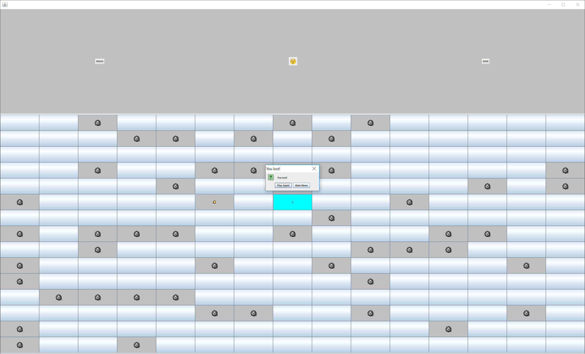

<H2>Summary</H2>
This project is a game that I made in my Introduction to Computer Science II (ICS 211) class. The objective of this project was to implement data structures and other concepts that were learned in the class into a larger project. I worked in a group of four to complete this project.

<H2>Features/How to Play</H2>
When the game is first started up, the user is presented with a menu screen with options to play, view high scores, or quit. After the play button is clicked, the user will be able to select the difficulty at which they wish to play the game. There are three difficulties: easy, medium, and hard. Easy is a 10x10 grid, medium is a 15x15 grid, and hard is a 20x20 grid. Clicking on the face emoticon on the top center will provide the option of returning to the main menu or restarting the game. The rest of the game works the same way that the usual Minesweeper game would work.

<H2>How it was made</H2>
This Minesweeper game makes use of the array list and stack data structures. The array list data structure is used to store the high scores. The high scores are then sorted in the array list using insertion sort. The stack data strucutre is used in the algorithm used to clear the board spaces after a click. 

I was responsible for the win/lose, reset game, and high scores feature in this project. The win function determines whether the game is in progress, won, or lost. Once the game state is set by the win function, a dialog box is triggered to pop up to notify the player that they won the game. The reset game function clears all of the elements on the board and then randomly generates a new board. I ran into a few obstacles when working on this part because all of the elements were not clearing from the game board. The high scores features reads any saved scores from a text file and adds it to an array list. Once the game is finished, the score is added to the array list and then the array list is sorted using insertion sort. After the sorting is done, the scores and player names in the array list is then written to the saved high scores text file. Whenever a user views the high scores, the high scores are read from the saved text file. 
