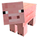
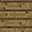
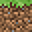

  
  
  
  

<iframe width="560" height="315" src="https://www.youtube.com/embed/qTAJljvxtys" frameborder="0" allowfullscreen></iframe>

<H2>Summary</H2>
The Minecraft Sticker Book is the first programming project that I worked on. This project was an assignment in my Introduction to Computer Science I (ICS 111) class. The assignment was to make a sticker book of our choice where the user could place and remove stickers on the canvas. I chose the Minecraft theme because it was a game that I played a lot while I was in middle school. 

<H2>How to Play</H2>
When the game is started, the user is presented with a blank Minecraft themed canvas and a choice of four stickers. The four stickers that a user can choose from are: Steve, Pig, Wood Block, and Grass Block. Steve is the name of the defaul character that people play as in Minecraft, the pig is a very common animal that players interact with, and both the wood and grass block are basic building materials. The player of the sticker book game can click on any of the four stickers to select one and can left click anywhere on the canvas to place a sticker. Once a sticker is placed, the corresponding sound effect will play. Right clicking on any sticker will remove the sticker. Players also have the option to save their current canvas and load other saved canvases.

<H2>How it was made</H2>
The entire project was written in the Java programming language. This project heavily uses the EZ graphics multimedia library created by Dylan Kobayashi. EZ graphics allowed me to easily create a graphical user interface (GUI) as a beginner programmer. 

