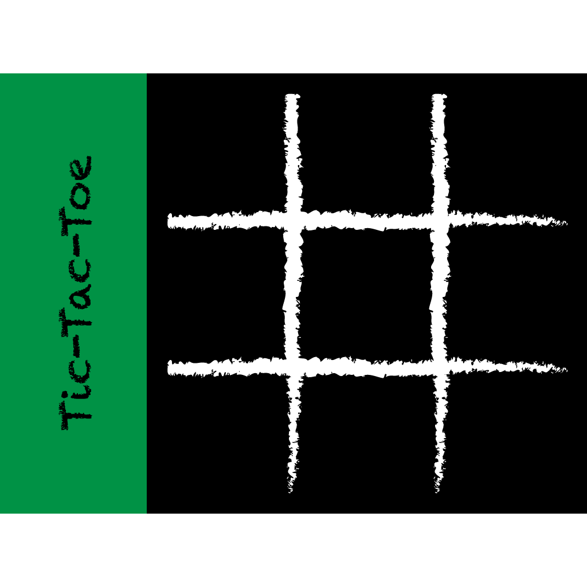

<H2>Summary</H2>
This Tic Tac Toe game was my final project for my Introduction to Computer Science I class. This project holds significance to me, because at the beginning of the semester, I had no programming experience and by the end of the semester, I was able to create a project with a group of my own choice. The project only required that we used the different skills that we learned in the class. My group of 3 people was able to finish the project with a lot of time to spare, but all of us wanted to keep on working on it until the deadline to improve more on it. You can download and run the game <a href="https://github.com/chadmorita/tic-tac-toe" target="_blank">here</a>. I have chosen not to upload the full source code for the project because I have not gotten permission from all of the contributors, but you can still download and play the game.

<H2>Features/How to Play</H2>
  All of the graphics in this game were created using the <a href="http://www2.hawaii.edu/~dylank/ics111/" target="_blank">EZ Graphics media library</a>. When the game is first started, there is a start screen that gives the player an option to select single player or multiplayer mode. In multiplayer mode, two people can play against each other using the right and left click buttons on the mouse. If the user selects single player mode, they will have the option of choosing an easy or medium difficulty computer player. For the easy difficulty, the computer player will just randomly place an "O", but the medium difficulty computer player has a few rules setup so it will be a little "smarter" when placing an "O".

  For this project, I worked on the single player feature. Initially, I planned to make an unbeatable computer player, but I soon found that this was a little ambitious for someone who had just learned how to code. It is possible to create an unbeatable tic tac toe computer player using a <a href="https://en.wikipedia.org/wiki/Minimax" target="_blank">Minimax Algorithm</a>, which I would like to eventually implement.
